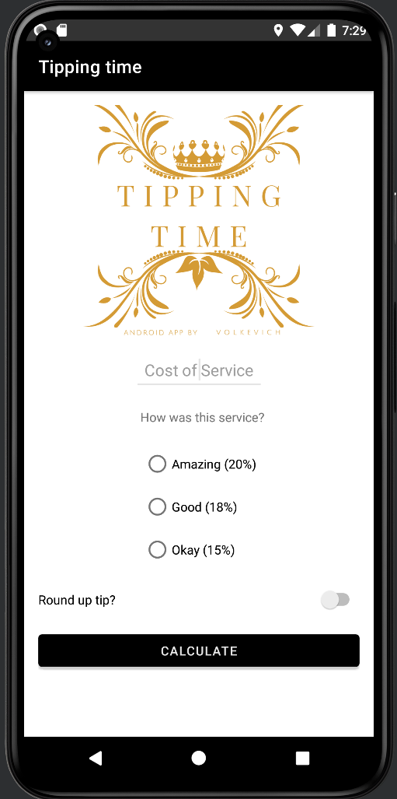
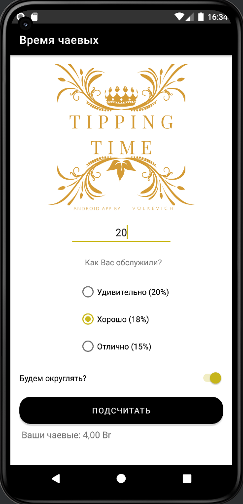

# **Tipping Time App** :iphone::moneybag:
### In this repository, there is an application available that computes tips according to the total bill amount and the quality of service.
###   
___
### This app will help you calculate the amount of tips based on your total bill and satisfaction with the service.
### The interface is very simple. To get the result you need:
 - #### Enter the total bill in the field "Cost of Service";
 - #### Select your satisfaction with the service;
 - #### (Optional) Choose mode: to round up the tip or not to;
 - #### Click the button "Calculate".
### Once all actions are completed, the total tip amount will be displayed on the right, beneath the button.

#### Supported android versions :8.0 (Oreo) - API 26 and higher
#### Memory size :minidisc:: 3,86 МБ (4 054 095 байт)

## Screenshots of the Application:

### Light mode and English:

### Light mode and Russian:

